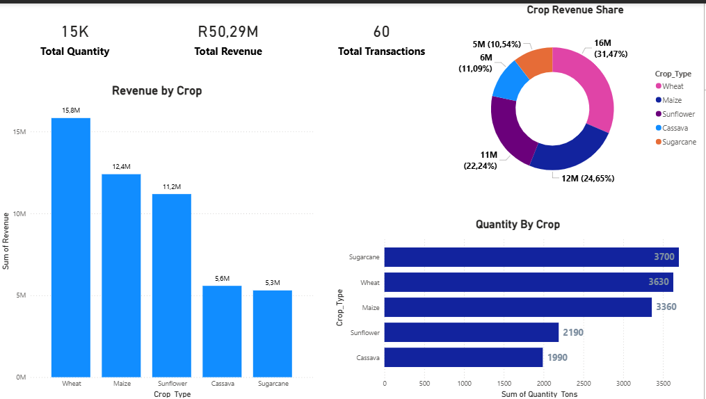

# 🌾 Agricultural Supply Chain Analytics

## 📊 Project Overview

This project analyzes an agricultural supply chain covering farms, processing plants, and distribution centers.  

The goal is to simulate how agricultural products move through the value chain while evaluating:

- Farm production capacity
- Crop revenue performance
- Supply chain distribution efficiency
- Processing plant throughput
- Revenue generation across the supply network

The project demonstrates **data modeling, supply chain analytics, and interactive dashboard design using Excel and Power BI.**

---

# 🛠 Tools Used

- Microsoft Excel (Data Modeling & Dataset Creation)
- Power BI (Data Visualization & Dashboard Development)
- GitHub (Project Version Control)

---

# 📂 Dataset Structure

The dataset simulates an agricultural ecosystem with four relational tables:

### Farms
Contains farm production information including:

- Farm ID
- Farm Name
- Location
- Crop Type
- Farm Size (Hectares)
- Annual Production (Tons)

### Processing Plants
Represents facilities where crops are processed.

- Plant ID
- Plant Name
- Location
- Processing Type
- Processing Capacity

### Distribution Centers
Storage and logistics facilities responsible for distributing processed goods.

- Distribution ID
- Distribution Name
- Location
- Storage Capacity

### Supply Transactions
Tracks crop movements through the supply chain.

- Transaction ID
- Farm ID
- Plant ID
- Distribution ID
- Crop Type
- Quantity (Tons)
- Revenue

---

# 📈 Power BI Dashboards

## 🌱 Farm Production Overview

This dashboard highlights:

- Total farms in the network
- Total agricultural production
- Revenue generated from supply transactions
- Production performance across farms
- Crop distribution across the agricultural portfolio

---

## 🌾 Crop Performance Analysis

This dashboard analyzes crop-level financial performance:

- Revenue generated by each crop
- Quantity supplied across crops
- Market share of each crop type
- Identification of the most profitable agricultural products

---

## 🚛 Supply Chain Distribution

This dashboard focuses on supply chain efficiency:

- Quantity processed by each plant
- Revenue generated through processing facilities
- Distribution center capacity analysis
- End-to-end agricultural supply chain flow

---

# 📊 Key Insights

Some important observations from the analysis:

- Certain crops dominate revenue generation across the supply chain.
- Large farms contribute a significant share of production output.
- Processing plants act as key bottlenecks in throughput capacity.
- Distribution centers determine how efficiently agricultural products move through the supply network.

---

# 👤 Author

**Boiketlo Lorekang**

LinkedIn  
https://www.linkedin.com/in/boiketlo-lorekang-931337241

GitHub  
https://github.com/BoiketloTLorekang